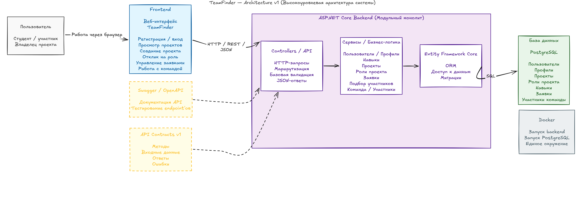

# Architecture v1

## Общая схема

Исходник схемы для редактирования: [architecture-v1.excalidraw](architecture-v1.excalidraw).

TeamFinder v1 строится как клиент-серверное веб-приложение.

Backend реализуется как модульный монолит на ASP.NET Core: основные предметные области разделены логически внутри одного приложения, без выделения отдельных микросервисов.

Основной поток взаимодействия:

Frontend → Controllers / API → Services / бизнес-логика → Entity Framework Core → база данных.

## Основные части системы

### Frontend

Веб-интерфейс TeamFinder.

Frontend отвечает за взаимодействие с пользователем и отправляет HTTP-запросы в backend.

Основные пользовательские действия:

- регистрация и вход;
- работа с профилем;
- просмотр проектов;
- создание проекта;
- отклик на роль;
- работа с заявками;
- работа с командой.

### ASP.NET Core Backend

Backend реализуется на ASP.NET Core и содержит основные серверные компоненты системы.

Архитектурный стиль первой версии — модульный монолит.

### Controllers / API

Точка входа HTTP-запросов от frontend.

Controllers отвечают за:

- маршрутизацию;
- получение входных данных;
- базовую валидацию;
- вызов бизнес-логики;
- формирование HTTP / JSON-ответов.

### Services / бизнес-логика

Содержит основные бизнес-правила TeamFinder.

Логические модули:

- Users / Profiles;
- Skills;
- Projects;
- Project Roles;
- Applications;
- Matching;
- Membership / Team.

Эти модули являются частями одного backend-приложения и не являются отдельными микросервисами.

### Entity Framework Core

Используется backend для работы с данными.

Основные задачи:

- ORM;
- доступ к данным;
- работа с сущностями;
- миграции схемы базы данных.

### База данных

Для хранения данных используется реляционная база данных.

PostgreSQL рассматривается как рабочий вариант СУБД.

В базе хранятся данные о:

- пользователях и профилях;
- проектах;
- ролях проекта;
- навыках;
- заявках;
- участниках команд.

### Swagger / OpenAPI

Используется для:

- описания API;
- просмотра endpoint'ов;
- тестирования HTTP-запросов.

### API Contracts v1

Определяют соглашение между frontend и backend:

- HTTP-методы;
- URL endpoint'ов;
- входные данные;
- ответы;
- основные ошибки.

### Docker

Используется для воспроизводимого локального запуска компонентов проекта и одинакового окружения разработки.

## Путь обычного запроса

Пример прохождения запроса через систему:

Пользователь  
→ Frontend  
→ HTTP / REST / JSON  
→ Controllers / API  
→ Services / бизнес-логика  
→ Entity Framework Core  
→ PostgreSQL  
→ ответ возвращается через backend во Frontend  
→ пользователь получает результат.