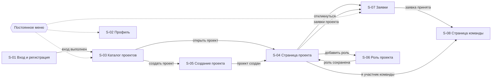

# TeamFinder — первоначальный UI-дизайн v1

Статус: v1 (для первого чекпоинта)
Владелец документа: Участник 3 (Frontend / Designer / BA)
Reviewer: Участник 1 (Team Lead / Backend)
Связанные документы: `use-cases.md`, `business-rules.md`, `functional-requirements.md`

Макет: https://www.figma.com/design/Q44zk3J1QJNeWsQDKUcoNT (файл «TeamFinder UI v1»)
Экспорт экранов: `ui/` в этом репозитории

---

## 1. Назначение документа

Документ описывает состав экранов первой версии TeamFinder, содержимое каждого экрана, переходы между ними и ключевые пользовательские действия. Служит связкой между сценариями использования и будущей реализацией frontend.

Уровень проработки — низкая детализация: структура экрана и состав элементов. Цветовая схема, типографика и компонентная библиотека в первой версии не фиксируются.

---

## 2. Состав экранов

| ID | Экран | Доступ | Сценарии |
|---|---|---|---|
| S-01 | Вход и регистрация | гость | UC-01, UC-02 |
| S-02 | Профиль пользователя | авторизованный | UC-03 |
| S-03 | Каталог проектов | авторизованный | UC-06 |
| S-04 | Страница проекта | авторизованный | UC-07, UC-08 |
| S-05 | Создание и редактирование проекта | владелец | UC-04 |
| S-06 | Создание и редактирование роли проекта | владелец | UC-05 |
| S-07 | Заявки | автор заявки и владелец | UC-09, UC-10, UC-11, UC-12 |
| S-08 | Страница команды | владелец и участники | UC-13, UC-14 |

---

## 3. Карта переходов

Верхняя цепочка — основной путь кандидата: вход, каталог, проект, заявка, команда. Ответвления вниз — действия владельца проекта.

Сплошные стрелки — переходы по действию пользователя, пунктирные — навигация через постоянное меню. Меню доступно на всех экранах кроме S-01: каталог, мои заявки, мои проекты, профиль, выход.

---

## 4. Описание экранов

### S-01. Вход и регистрация

Назначение: получить доступ к системе.

Состав:

- переключатель между формой входа и формой регистрации;
- поля учётной записи и пароля;
- для регистрации — подтверждение пароля;
- кнопка действия;
- область вывода ошибок формы.

Действия: войти, зарегистрироваться.

Состояния: обычное, отправка запроса, ошибка валидации полей, ошибка входа.

Особенности: при неверных данных входа показывается общее сообщение, без уточнения, какое поле неверно (FR-AUTH-07). После регистрации пользователь сразу авторизуется и попадает на S-02.

---

### S-02. Профиль пользователя

Назначение: заполнить данные, на основании которых работает сопоставление.

Состав:

- имя и краткая информация о себе;
- блок «Интересующие роли»: выбор типов ролей из справочника;
- блок «Навыки»: список добавленных навыков, у каждого — уровень (начинающий, средний, продвинутый) и кнопка удаления;
- форма добавления навыка: выбор из справочника плюс выбор уровня;
- кнопка сохранения;
- ссылка на GitHub или портфолио (необязательное поле).

Данные: User, Profile, UserSkill, UserRoleInterest, справочники Skill и RoleType.

Действия: сохранить профиль, добавить навык, изменить уровень, удалить навык, добавить и удалить интересующую роль.

Состояния: загрузка справочников, пустой профиль, ошибка сохранения.

Особенности: навык, уже добавленный в профиль, не должен предлагаться повторно в списке выбора (RULE-PROF-02). Незаполненный профиль — не ошибка, но на S-04 покажет нулевое соответствие, поэтому уместна подсказка о пользе заполнения.

---

### S-03. Каталог проектов

Назначение: поиск подходящего проекта.

Состав:

- панель фильтров: тип роли, навык, тип проекта, переключатель «только открытый набор»;
- кнопка сброса фильтров;
- список карточек проектов.

Карточка проекта: название, тип проекта, состояние проекта, краткое описание, список открытых ролей с заполненностью в формате «принято / всего мест».

Данные: Project, ProjectRole, Membership (для подсчёта занятых мест).

Действия: применить фильтр, сбросить фильтры, открыть проект, перейти к созданию проекта.

Состояния: загрузка, пустой результат с подсказкой изменить фильтры, ошибка загрузки.

Особенности: проекты в состоянии «черновик» в каталоге не показываются (FR-CAT-07). Фильтры комбинируются.

---

### S-04. Страница проекта

Назначение: изучить проект, оценить соответствие и подать заявку. Для владельца — управлять проектом.

Состав:

- шапка: название, тип проекта, состояние проекта, описание, владелец;
- список ролей проекта, для каждой роли:
  - тип роли и описание;
  - заполненность «принято / всего мест»;
  - обязательные навыки с минимальным уровнем, если задан;
  - желательные навыки;
  - блок соответствия;
  - кнопка «Откликнуться».

Блок соответствия (ключевой элемент экрана): по каждому обязательному навыку — есть ли он у пользователя и достаточен ли уровень; по каждому желательному — есть или нет; итог в виде «совпало N из M обязательных, K из L желательных»; отметка, совпадает ли тип роли с интересующими ролями пользователя. Процент соответствия не показывается (RULE-MATCH-06).

Данные: Project, ProjectRole, RoleSkillRequirement, UserSkill, UserRoleInterest, Application (для определения, подавал ли пользователь заявку).

Действия для кандидата: откликнуться на роль, перейти к своим заявкам.
Действия для владельца: редактировать проект, добавить роль, редактировать роль, перейти к заявкам проекта, сменить состояние проекта.
Действия для участника команды: перейти на страницу команды.

Состояния кнопки «Откликнуться»:

| Условие | Вид кнопки | Правило |
|---|---|---|
| Проект не в наборе | отключена, подпись «Набор закрыт» | RULE-LIFE-03 |
| Все места роли заняты | отключена, подпись «Мест нет» | RULE-ROLE-10 |
| Заявка уже подана | отключена, показывается статус заявки | RULE-APP-02 |
| Пользователь — владелец | скрыта | RULE-APP-06 |
| Иначе | активна | — |

Особенности: отключение кнопки — только удобство, проверка выполняется на сервере в любом случае (FR-UX-02). Нажатие открывает модальное окно с полем комментария и подтверждением отправки.

---

### S-05. Создание и редактирование проекта

Назначение: завести проект и управлять его параметрами.

Состав:

- поле названия;
- поле описания;
- выбор типа проекта: pet-проект, хакатон, учебный проект;
- поле внешнего контакта команды (необязательное);
- блок управления состоянием проекта: текущее состояние и доступные переходы;
- кнопка сохранения.

Данные: Project.

Действия: создать проект, сохранить изменения, открыть набор, перевести в работу, завершить, отменить.

Состояния: создание, редактирование, ошибка валидации, подтверждение необратимого перехода.

Особенности: новый проект создаётся в состоянии «черновик» (RULE-LIFE-01). В блоке состояния показываются только допустимые переходы; перевод в работу и отмена требуют подтверждения, так как закрывают все ожидающие заявки (RULE-APP-07).

---

### S-06. Создание и редактирование роли проекта

Назначение: описать позицию, на которую нужны люди.

Состав:

- выбор типа роли из справочника;
- поле описания;
- поле количества мест;
- блок обязательных навыков: выбор навыка и, при необходимости, минимального уровня;
- блок желательных навыков;
- кнопка сохранения.

Данные: ProjectRole, RoleSkillRequirement, справочники Skill и RoleType.

Действия: добавить роль, сохранить изменения, добавить и удалить требование к навыку.

Состояния:

- роль без заявок — редактируются все поля;
- роль с заявками — тип роли и требования к навыкам заблокированы, редактируются только описание и количество мест, рядом поясняющая подпись (RULE-ROLE-06);
- ошибка валидации.

Особенности: количество мест не может быть меньше одного и не может быть уменьшено ниже числа принятых участников (RULE-ROLE-01, RULE-ROLE-08). Один навык нельзя выбрать одновременно обязательным и желательным (RULE-ROLE-02). Роль без обязательных навыков допустима (RULE-ROLE-03).

---

### S-07. Заявки

Экран с двумя режимами. Режим определяется тем, откуда пользователь пришёл.

#### Режим «Мои заявки»

Состав: список заявок пользователя, в каждой строке — название проекта, роль, дата подачи, статус, кнопка отзыва.

Статусы: ожидает решения, принята, отклонена, отозвана, закрыта.

Действия: отозвать заявку, перейти к проекту, перейти на страницу команды для принятой заявки.

Особенности: кнопка отзыва активна только для заявок в статусе «ожидает решения» (RULE-APP-03).

#### Режим «Заявки проекта»

Состав: заявки, сгруппированные по ролям проекта; заголовок группы показывает заполненность роли. Карточка заявки: имя кандидата, информация о себе, навыки с уровнями, интересующие роли, комментарий к заявке, блок соответствия, статус, кнопки «Принять» и «Отклонить».

Данные: Application, Profile, UserSkill, ProjectRole, Membership.

Действия: принять кандидата, отклонить кандидата, открыть профиль кандидата.

Особенности: при отсутствии свободных мест кнопка «Принять» отключается, но сервер всё равно проверяет ограничение (RULE-CAP-02, RULE-CAP-03). Если при попытке принять возвращается ошибка заполненности роли, экран показывает сообщение и обновляет данные. Принятие — необратимое действие, уместно подтверждение.

Состояния обоих режимов: загрузка, пустой список, ошибка.

---

### S-08. Страница команды

Назначение: показать сформированную команду и способ связи.

Состав:

- название проекта и его состояние;
- список участников: имя, роль в проекте;
- внешний контакт команды;
- кнопка «Выйти из команды» для участника;
- кнопка исключения рядом с каждым участником для владельца.

Данные: Project, Membership, ProjectRole, User.

Действия: выйти из команды, исключить участника, перейти к проекту.

Состояния: команда пуста, ошибка, подтверждение выхода или исключения.

Особенности: внешний контакт виден только владельцу и действующим участникам (RULE-TEAM-07). Выход и исключение требуют подтверждения; после них доступ к экрану пропадает (RULE-TEAM-04). Если внешний контакт не указан, блок показывает соответствующую подпись.

---

## 5. Общие правила интерфейса

| Правило | Обоснование |
|---|---|
| Каждый экран со списком имеет три состояния: загрузка, пустой результат, ошибка | FR-UX-03 |
| Недоступное по бизнес-правилу действие отключается, а не скрывается, и сопровождается подписью с причиной | FR-UX-01 |
| Отключение элемента не заменяет проверку на сервере | FR-UX-02 |
| Необратимые действия подтверждаются: принятие кандидата, исключение, выход из команды, перевод проекта в работу, завершение и отмена | RULE-APP-07, RULE-TEAM-04 |
| Ошибка бизнес-правила показывается понятным текстом, а не техническим кодом | FR-UX-04 |
| Заполненность роли везде отображается единообразно: «принято / всего мест» | FR-ROLE-07 |

---

## 6. Соответствие сценариям

| Сценарий | Экран |
|---|---|
| UC-01 Регистрация | S-01 |
| UC-02 Вход | S-01 |
| UC-03 Редактирование профиля | S-02 |
| UC-04 Создание проекта | S-05 |
| UC-05 Создание роли проекта | S-06 |
| UC-06 Просмотр каталога | S-03 |
| UC-07 Просмотр соответствия | S-04 |
| UC-08 Подача заявки | S-04 |
| UC-09 Отзыв заявки | S-07 |
| UC-10 Просмотр заявок проекта | S-07 |
| UC-11 Принятие заявки | S-07 |
| UC-12 Отклонение заявки | S-07 |
| UC-13 Выход из команды | S-08 |
| UC-14 Исключение участника | S-08 |
| UC-15 Перевод проекта в работу | S-05 |
| UC-16 Завершение и отмена проекта | S-05 |

Все шестнадцать сценариев покрыты восемью экранами.
