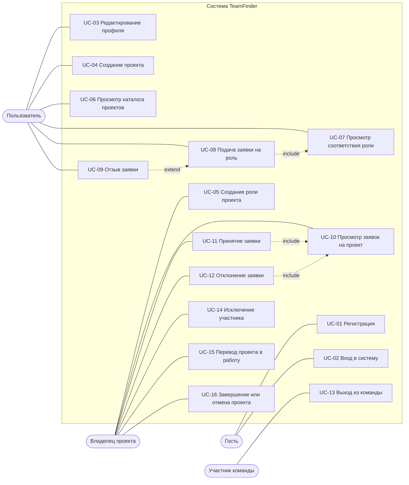
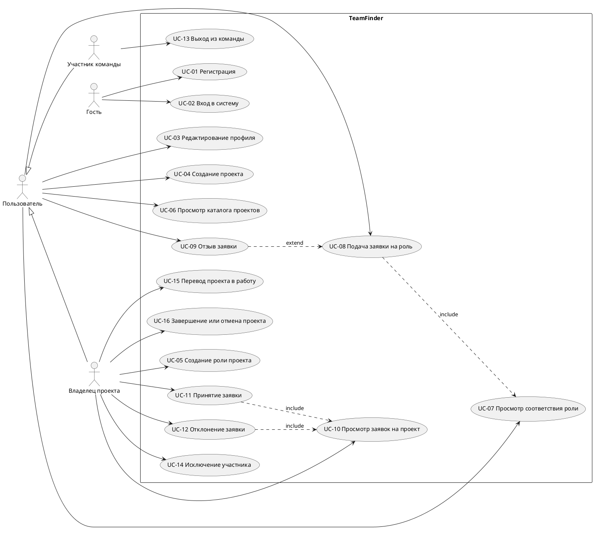

# TeamFinder — Use Case Diagram v1

Статус: v1 (для первого чекпоинта)
Владелец документа: Участник 3 (Business Analyst)
Reviewer: Участник 2 (PM / System Analyst)
Связанный документ: `use-cases.md`

Диаграмма отражает границу системы, акторов и сценарии UC-01 … UC-16.

---

## 1. Диаграмма (Mermaid, рендерится в GitHub)

Наследование акторов: Владелец проекта и Участник команды являются частными случаями актора Пользователь, поэтому им доступны и сценарии UC-03, UC-06 … UC-09.

---

## 2. Та же диаграмма в нотации UML (PlantUML)

Используется для вставки в отчёт и для экспорта в изображение.

---

## 3. Пояснения к связям

| Связь | Тип | Обоснование |
|---|---|---|
| UC-08 → UC-07 | include | Перед подачей заявки кандидату всегда показывается разбор соответствия роли |
| UC-11 → UC-10 | include | Принятие выполняется из карточки заявки, открытой в списке заявок проекта |
| UC-12 → UC-10 | include | Отклонение выполняется там же |
| UC-09 → UC-08 | extend | Отзыв возможен только если заявка была подана и ещё ожидает решения |
